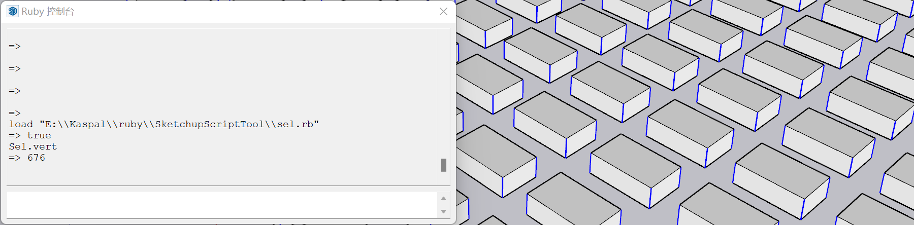
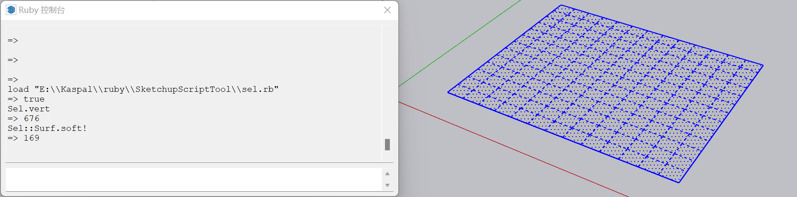

# SketchupScriptTool
SketchUp command tool for ruby console, some Sketchup::Tool draft included.

mostly test on SketchUp 2018 (ruby 1.9)

适用于ruby控制台的代码工具，也包含部分工具类的草稿。

大部分代码在 SketchUp 2018 (ruby 1.9) 中测试正常运行，较低版本不一定能正常使用。

## 使用方法

第一步：以sel.rb为例，下载sel.rb文件到 *D:\\ruby_code\\* 路径。

第二步：启动SketchUp后打开ruby控制台。

第三步：使用 *load* 方法加载Ruby脚本，然后在ruby控制台中输入以下代码：

```ruby
load "D:\\ruby_code\\sel.rb"
```

第四步：调用脚本中模块的方法，例如以下两个案例：

```ruby
Sel.vert
#以上代码执行sel.rb脚本中Sel模块中的vert方法
Sel::Surf.soft!
#以上代码执行sel.rb脚本中Sel模块中Surf模块之中的soft!方法
```






## 详细介绍

详细的模块介绍将逐步更新在[wiki页面](https://github.com/Apiglio/SketchupScriptTool/wiki)中。

**Mov** is for moving entities by axis and by fixed scale. 与移动图元有关的方法。
+ only contains one module named Mov. 


**Sca** is for scaling entities by axis and by fixed scale. 与缩放图元有关的方法。
+ only contains one module named Sca. 


**Cge** is for editing component and group. 所有与组件何群组操作相关的方法，包括多个子模块。
+ module Cge::DC is for dynamic component. 动态组件方法。
+ module Cge::MoveTool is for moving instance(ComponentInstance | Group) by its axis, with a GUI. 单个组件实例或群组的轴向运动工具。
+ module Cge::Move is for other moving operation such as grouding and aligning. 多图元移动方法，例如自由落体和对齐。
+ module Cge::Deform is for checking whether a instance has a "abnormal" transformation. 检测单个组件或群组的变形情况或内部构成。
+ module Cge::Defs is to check or clean DefinitionList. 与定义列表有关的一些操作，例如清理列表、更新组件、合并定义等。


**Sel** is for selection operation. 与选区有关的便捷操作。
+ module Sel::Width/ Height/ Depth/ Size is for selecting instances by their size, Size is the supermodule. 针对长宽高进行选取筛选，Size模块不可直接使用。
+ module Sel::Edit is for those can modify entities. 编辑选中的图元，这部分后续可能增加和其他模块之间的功能关联。
+ module Sel::Surf is for surface operation. 与表面有关的操作。


**Arh** is for architecture modelling. 用于有具体建筑物、构筑物形态意义的建模工具
+ module Arh::BuildTool is for very basical architecture modelling such as wall building. 


**Proj** is for projection operation. 点、线投影到各类平面、曲面的方法。
+ only contains one module named Proj. 


**Trans** is for transforming and shaping in some complex way. 一些变换操作，目前看来是一个杂项，由多个子模块组成。
+ Trans::Reduction uses simpler shape to describe a common shape. 简化图元将其抽象为一个点或其他简易图形。
+ Trans::Rand is random moving. 随机变换操作。
+ Trans::Curve is for drawing curve. 曲线操作，这个本应该单独是一个模块，暂时在此处。

**Cam** is for camera action. 与相机有关的操作。
+ Cam::LabelRanker is for hiding or showing label by level. 根据标注层级实时控制图元的显隐性。
